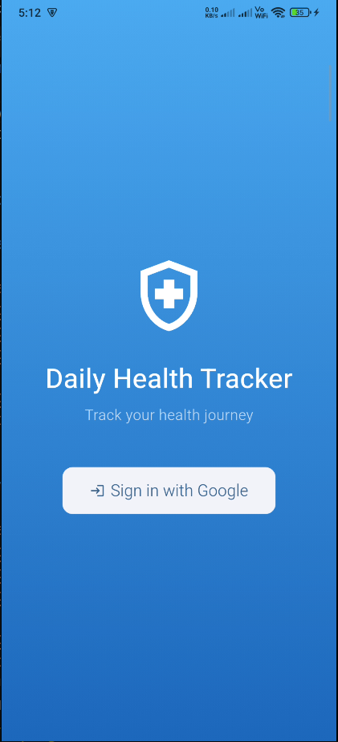
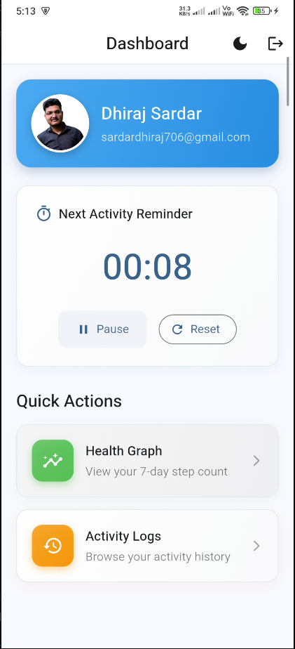
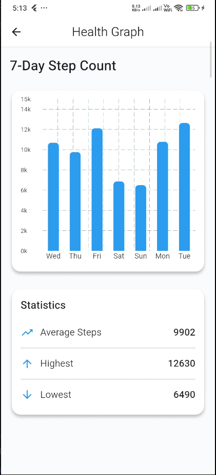
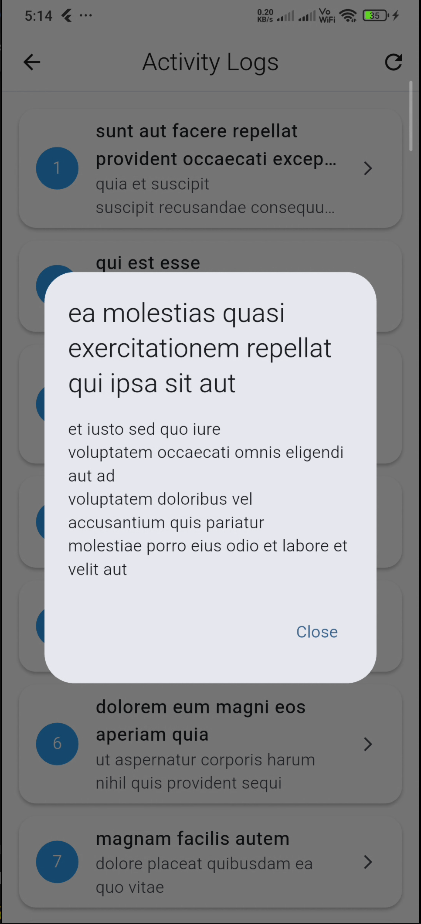
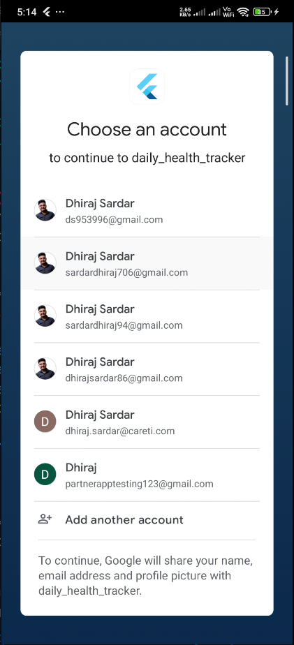
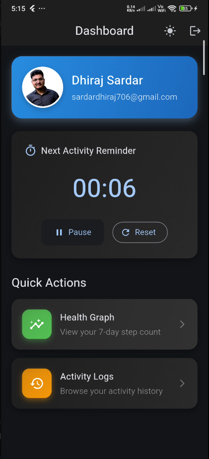
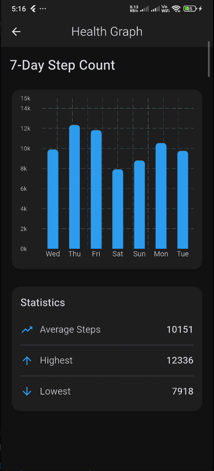
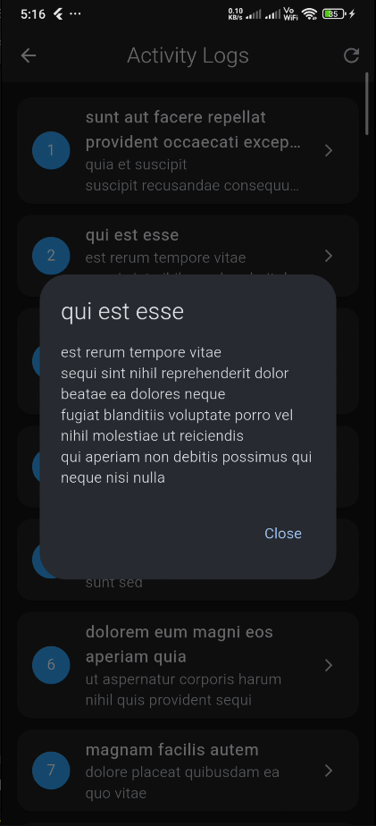

# Daily Health Tracker

A comprehensive Flutter application for tracking daily health activities, step counts, and wellness goals with a beautiful, modern UI.

## Demo Video

<div align="center">
  <video src="screenshots/demovideo/Kazam_screencast_00007.webm" width="1650" controls controlsList="nodownload" allowfullscreen>
    Your browser does not support the video tag.
  </video>
</div>

*Watch the app in action showcasing authentication, health tracking, activity timer, and more!*

##  Screenshots

### Light Theme Mode

<div align="center">
  
  
  
  
  
</div>

### Dark Theme Mode

<div align="center">
  
  
  
</div>


##  Features

###  Authentication
- Google Sign-In integration
- Secure user authentication with Firebase
- Persistent login sessions
- User profile display with avatar

###  Health Tracking
- 7-day step count visualization
- Interactive bar charts with fl_chart
- Statistics (Average, Highest, Lowest steps)
- Mock data generation for testing

###  Activity Timer
- Countdown timer for health activities
- Customizable duration (default: 10 minutes)
- Play, pause, and reset controls
- Local notifications on completion
- Background timer support

### Activity Logs
- Infinite scroll pagination
- Pull-to-refresh functionality
- Detailed activity view
- API integration with JSONPlaceholder
- Smooth animations

### UI/UX
- Material Design 3
- Light and Dark theme support
- Smooth animations and transitions
- Responsive design
- Custom color scheme
- Gradient cards and modern styling

## Tech Stack

- **Framework:** Flutter 3.9.2+
- **State Management:** GetX
- **Authentication:** Firebase Auth, Google Sign-In
- **Charts:** FL Chart
- **Notifications:** Flutter Local Notifications
- **HTTP:** HTTP package
- **Storage:** SharedPreferences
- **Architecture:** MVC Pattern

## Prerequisites

- Flutter SDK (3.9.2 or higher)
- Dart SDK (3.9.2 or higher)
- Android Studio / VS Code
- Firebase account
- Google Cloud Console account

## Getting Started

### 1. Clone the Repository

```bash
git clone https://github.com/yourusername/daily_health_tracker.git
cd daily_health_tracker
```

### 2. Install Dependencies

```bash
flutter pub get
```

### 3. Firebase Configuration

#### Step 1: Create Firebase Project

1. Go to [Firebase Console](https://console.firebase.google.com/)
2. Click "Add project"
3. Enter project name: `Daily Health Tracker`
4. Enable Google Analytics (optional)
5. Click "Create project"

#### Step 2: Add Android App

1. In Firebase Console, click "Add app" → Android icon
2. Enter Android package name: `com.example.daily_health_tracker`
3. Enter app nickname: `Daily Health Tracker`
4. Click "Register app"
5. Download `google-services.json`
6. Place it in `android/app/` directory

#### Step 3: Configure Firebase SDK

The project already has Firebase dependencies configured. Verify these files:

**android/build.gradle.kts:**
```kotlin
plugins {
    id("com.google.gms.google-services") version("4.3.15") apply false
}
```

**android/app/build.gradle.kts:**
```kotlin
plugins {
    id("com.google.gms.google-services")
}
```

#### Step 4: Enable Authentication

1. In Firebase Console, go to "Authentication"
2. Click "Get started"
3. Enable "Google" sign-in method
4. Add your support email
5. Click "Save"

#### Step 5: Configure Google Sign-In

1. Go to [Google Cloud Console](https://console.cloud.google.com/)
2. Select your Firebase project
3. Go to "APIs & Services" → "Credentials"
4. Click "Create Credentials" → "OAuth 2.0 Client ID"
5. Select "Android" as application type
6. Enter name: `Daily Health Tracker Android`
7. Get SHA-1 fingerprint:

```bash
# Debug SHA-1
keytool -list -v -keystore ~/.android/debug.keystore -alias androiddebugkey -storepass android -keypass android

# Release SHA-1 (if you have a release keystore)
keytool -list -v -keystore /path/to/your/keystore.jks -alias your-alias
```

8. Enter package name: `com.example.daily_health_tracker`
9. Enter SHA-1 fingerprint
10. Click "Create"
11. Download the updated `google-services.json` and replace in `android/app/`

### 4. Run the App

```bash
# Check connected devices
flutter devices

# Run on connected device
flutter run

# Run in release mode
flutter run --release
```

## Project Structure

```
lib/
├── controllers/          # GetX Controllers
│   ├── activity_controller.dart
│   ├── auth_controller.dart
│   ├── health_controller.dart
│   ├── theme_controller.dart
│   └── timer_controller.dart
├── models/              # Data Models
│   ├── activity_log_model.dart
│   ├── health_data_model.dart
│   └── user_model.dart
├── services/            # Business Logic
│   ├── api_service.dart
│   ├── auth_service.dart
│   ├── health_service.dart
│   └── notification_service.dart
├── views/               # UI Screens
│   ├── activity_logs_view.dart
│   ├── dashboard_view.dart
│   ├── graph_view.dart
│   └── login_view.dart
├── widgets/             # Reusable Widgets
│   ├── empty_state.dart
│   ├── loading_indicator.dart
│   └── timer_widget.dart
├── utils/               # Utilities
│   ├── app_colors.dart
│   ├── constants.dart
│   └── ui_helpers.dart
├── routes/              # Navigation
│   └── app_routes.dart
└── main.dart           # Entry Point
```

##  Key Features Explained

### Health Data Service

The app uses a mock health service that generates realistic step count data:

```dart
// Generates 7 days of step data
// Weekdays: 9000-13000 steps
// Weekends: 6000-9000 steps
```

### Activity Timer

- Default duration: 10 minutes (600 seconds)
- Sends notification when complete
- Persists across app restarts
- Can be customized in `lib/utils/constants.dart`

### API Integration

Uses JSONPlaceholder API for activity logs:
- Endpoint: `https://jsonplaceholder.typicode.com/posts`
- Pagination: 10 items per page
- Infinite scroll support

## Customization

### Change App Colors

Edit `lib/utils/app_colors.dart`:

```dart
static const Color primary = Color(0xFF2196F3);
static const Color success = Color(0xFF4CAF50);
static const Color warning = Color(0xFFFF9800);
```

### Change Timer Duration

Edit `lib/utils/constants.dart`:

```dart
static const int timerDuration = 600; // seconds
```

### Change API Endpoint

Edit `lib/utils/constants.dart`:

```dart
static const String apiBaseUrl = 'your-api-url';
```

##  Troubleshooting

### Firebase Issues

**Problem:** Google Sign-In not working

**Solution:**
1. Verify `google-services.json` is in `android/app/`
2. Check SHA-1 fingerprint is added in Firebase Console
3. Ensure Google Sign-In is enabled in Firebase Authentication
4. Run `flutter clean` and rebuild

### Build Issues

**Problem:** Build fails with Gradle errors

**Solution:**
```bash
cd android
./gradlew clean
cd ..
flutter clean
flutter pub get
flutter run
```

### Notification Issues

**Problem:** Notifications not showing

**Solution:**
1. Check notification permissions are granted
2. Verify `AndroidManifest.xml` has notification permissions
3. Test on a real device (emulator may have issues)

## Dependencies

```yaml
dependencies:
  flutter:
    sdk: flutter
  cupertino_icons: ^1.0.8
  get: ^4.6.6                              # State Management
  google_sign_in: ^6.2.1                   # Google Auth
  firebase_core: ^3.6.0                    # Firebase Core
  firebase_auth: ^5.3.1                    # Firebase Auth
  http: ^1.2.0                             # HTTP Requests
  fl_chart: ^0.66.2                        # Charts
  flutter_local_notifications: ^17.0.0     # Notifications
  shared_preferences: ^2.2.2               # Local Storage
```


## Contributing

1. Fork the repository
2. Create your feature branch (`git checkout -b feature/AmazingFeature`)
3. Commit your changes (`git commit -m 'Add some AmazingFeature'`)
4. Push to the branch (`git push origin feature/AmazingFeature`)
5. Open a Pull Request

##  License

This project is licensed under the MIT License - see the [LICENSE](LICENSE) file for details.

##  Author

**Your Name**
- GitHub: [@yourusername](https://github.com/yourusername)
- Email: sardardhiraj706@gmail.com

##  Acknowledgments

- [Flutter](https://flutter.dev/) - UI Framework
- [Firebase](https://firebase.google.com/) - Backend Services
- [GetX](https://pub.dev/packages/get) - State Management
- [FL Chart](https://pub.dev/packages/fl_chart) - Chart Library
- [JSONPlaceholder](https://jsonplaceholder.typicode.com/) - Mock API

##  Support

For support, email sardardhiraj706@gmail.com or open an issue in the repository.

---

Made with ❤️ using Flutter
